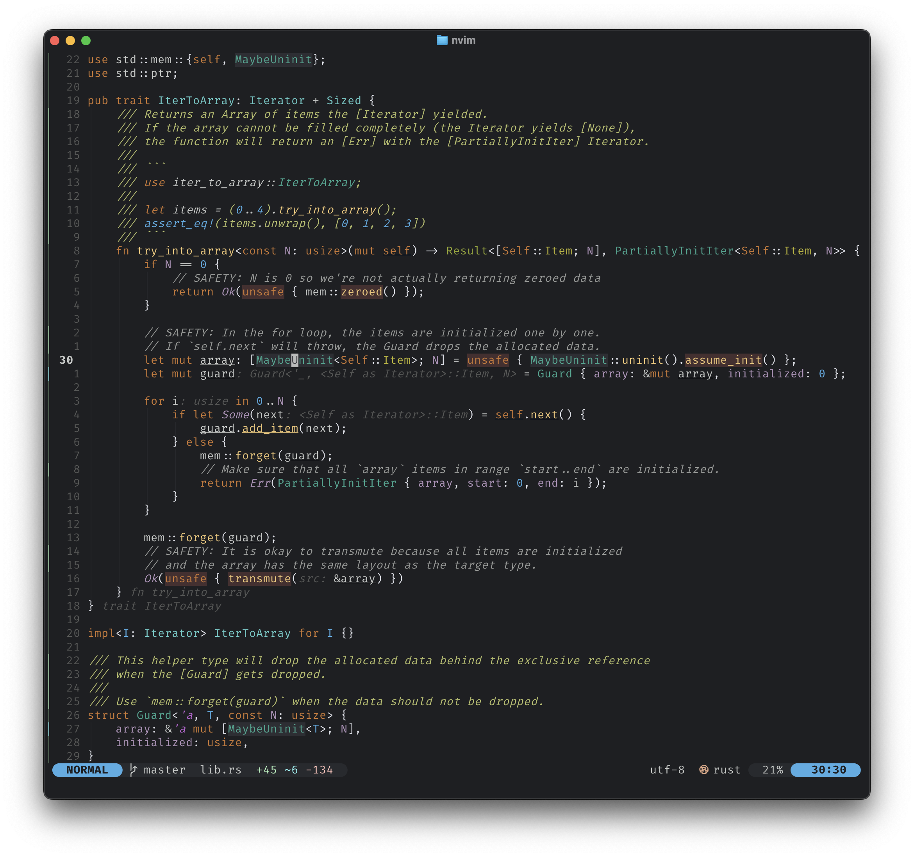

# darcula



Is theme is heavily inspired by the IntelliJ theme [Darcula](https://www.jetbrains.com/guide/java/tutorials/presenting/theme/)

## Features

- Supports
	- Treesitter
	- LSP (extended for Rust & Terraform)
	- Lualine
	- Gitsigns
	- Diffview
	- ShowMarks
	- IndentLine
	- WhichKey
- Neovim terminal colours

## Installation

Using [lazy.nvim](https://github.com/folke/lazy.nvim):

```lua
"LeonWiese/darcula"
```

Using [packer.nvim](https://github.com/wbthomason/packer.nvim):

```lua
use "LeonWiese/darcula"
```

## Usage

### lazy.nvim

```lua
return {
	"armannikoyan/darcula",
	lazy = false,
	priority = 1000,
	opts = {
		transparent = true,
		italic_comments = true,
		underline_current_line = true,
	},
	config = function(_, opts)
		require("darcula").setup(opts)
		vim.cmd("colorscheme darcula")
	end,
}
```

### packer.nvim

```lua
-- In Lua
vim.cmd([[colorscheme darcula]])

-- Alternatively
require("darcula").load()
```

## Lualine

```lua
theme = require("darcula").lualine
```

Special thanks to (armannikoyan/rusty)[https://github.com/armannikoyan/rusty] for the inspiration!

